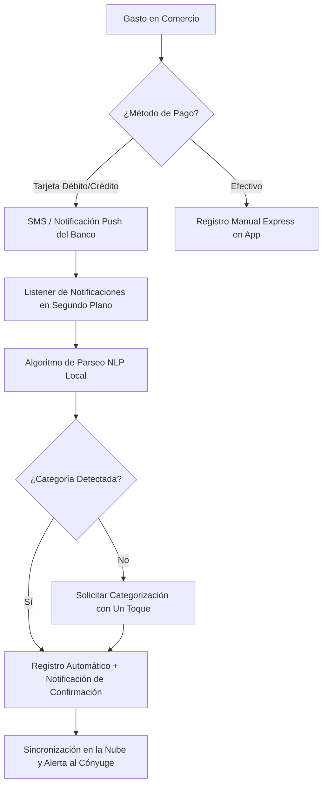

# LeakLess — Especificación de Producto y Diseño para App Móvil (Flutter)

Este documento detalla la conceptualización técnica y visual de **LeakLess** adaptada para dispositivos móviles mediante **Flutter**. Esta propuesta abandona el estilo "Dark Mode" tradicional en favor de un sistema visual fresco, moderno y con estética **Liquid Glass (estilo iOS translúcido)**, enfocado en resolver de raíz las fugas financieras en pareja con fricción cero y notificaciones cruzadas.

---

## 🎯 1. Objetivo del Producto

El principal enemigo del ahorro en pareja no son los grandes gastos (que suelen planificarse y discutirse), sino las **micro-fugas de dinero no registradas** y la **asimetría de información** (no saber cuánto ha gastado el otro en tiempo real, lo que lleva a duplicar consumos o sobrepasar presupuestos).

**LeakLess** en móvil busca:
1. **Visibilizar la Fuga de Forma Físico-Visual:** Transformar la abstracción de "números que no cuadran" en un elemento visual (un contenedor de líquido que se vacía si hay dinero perdido).
2. **Sincronización Total e Instantánea:** Actuar como un libro contable común en tiempo real. Si uno gasta, ambos lo saben y lo sienten inmediatamente.
3. **Eliminar la Fricción del Registro:** Mediante lectura inteligente de notificaciones y SMS bancarios en el futuro.

---

## 🎨 2. Sistema de Diseño: Liquid Glass

Para lograr un toque fresco, moderno y sofisticado, el diseño se inspira en el efecto **Liquid Glass** de iOS, utilizando translucidez, gradientes orgánicos de fondo, refracciones de luz y sombras difusas. No es una app oscura; es una app clara y vibrante que respira espacio.

### Paleta de Colores
*   **Fondo Base (Fresco):** `#F0F4FA` (Azul hielo extremadamente claro y limpio).
*   **Vidrio Esmerilado (Glass Cards):** `rgba(255, 255, 255, 0.55)` con un desenfoque de fondo (`backdrop-filter: blur(25px)`) y borde de refracción blanco semi-transparente.
*   **Ingresos / Futuro:** `#00D09C` (Verde menta brillante, transmite crecimiento y frescura).
*   **Gastos Importantes:** `#FF5A79` (Rosa coral vibrante, destaca sin ser agresivo).
*   **Alertas / Alarma de Límites:** `#FFB03A` (Ámbar cálido translúcido).
*   **Ahorro / Metas:** `#3082FF` (Azul cielo eléctrico).
*   **Detalles / Texto Principal:** `#1E293B` (Azul pizarra profundo para máxima legibilidad).

### Tipografía y Elementos Visuales
*   **Fuentes:** *Outfit* (para números grandes y cabeceras) y *SF Pro* (para textos y etiquetas).
*   **Iconografía (SF Symbols Style):** En lugar de emojis genéricos del sistema o ilustraciones prediseñadas, se usarán glifos lineales ultra-delgados con rellenos en gradiente (estilo iOS).
*   **Efecto "Líquido":** Gradientes interactivos en los medidores que se mueven levemente con el giroscopio del teléfono (utilizando animaciones de físicas de Flutter).

---

## 📱 3. Arquitectura de Pantallas (Flutter Views)

### Pantalla 1: Dashboard "Frente a Frente" (El Hidrómetro Financiero)
*   **Visual principal:** Un cilindro central de vidrio translúcido en 3D (renderizado con CustomPainter en Flutter o Rive) que contiene un líquido de gradiente azul-verde.
    *   Si los gastos coinciden con el saldo, el líquido está en calma.
    *   Si el saldo real es menor al esperado (fuga), el fondo del contenedor gotea virtualmente y el nivel baja, mostrando el monto exacto de la "fuga" flotando sobre el agua en color ámbar.
*   **Panel Superior Flotante:** Selector de mes en vidrio curvo y balance disponible.
*   **Sección Pareja:** Dos burbujas circulares con las fotos de perfil. Un hilo conductor une ambas fotos y brilla cuando hay actividad reciente.
*   **Tarjetas de Resumen (Carousel):** 
    *   Tarjeta 1: Tasa de Ahorro Real.
    *   Tarjeta 2: Suscripciones activas este mes.
    *   Tarjeta 3: Alertas de límites activos.

### Pantalla 2: Registro Rápido (Quick Entry Overlay)
*   *Diseñado para usarse con una sola mano.* Se despliega desde la parte inferior como una hoja de vidrio líquido (BottomSheet con desenfoque).
*   **Teclado Numérico Custom:** Botones grandes redondos de vidrio transparente.
*   **Selector de Responsable:** Un control deslizante horizontal suave (Swipe Segmented Control) para marcar quién lo pagó: *Tú / Ella / Compartido*.
*   **Selector de Categoría:** Rueda giratoria o grilla táctil con iconos minimalistas retroiluminados.
*   **Selector de Prioridad:** Cuatro botones elegantes con micro-gradientes: *Necesidad / Estilo de Vida / Futuro / Hormiga*.

### Pantalla 3: Semáforos e Historial Inteligente
*   Presenta los presupuestos asignados a cada categoría mediante "Tubos de Líquido".
*   Cuando un presupuesto supera el 75%, el contenedor de vidrio empieza a teñirse de amarillo y a emitir un sutil destello ámbar en los bordes. Al sobrepasar el 100%, el líquido se vuelve coral brillante y activa un botón de "Ajuste de Emergencia" para transferir presupuesto de otra categoría menos prioritaria.
*   Historial inferior deslizable con filtros táctiles instantáneos por responsable y prioridad.

### Pantalla 4: El Colchón y Metas (El Cofre Translúcido)
*   **Fondo de Emergencia:** Muestra el cálculo de los meses cubiertos (3 o 6 meses) representados por capas de vidrio superpuestas. Cada capa ganada se vuelve sólida y brillante.
*   **Metas de Ahorro:** Tarjetas de metas con barras de progreso líquidas. Tienen un botón integrado de "Aporte Express" de montos predefinidos ($50, $100).

---

## ⚡ 4. Funcionalidades Core Especializadas

### A. Cuenta Única Familiar Sincronizada
Para evitar el retraso en el registro, la app opera bajo una única cuenta de base de datos en la nube (compartida) usando una estructura **Publisher-Subscriber en Tiempo Real** (vía Firebase Firestore o WebSockets).
*   **Push Notificaciones de Acción Inmediata:** Cuando tu pareja registra un gasto, recibes una notificación enriquecida interactiva:
    *   *Ejemplo de notificación:* `Girlfriend logged: Uber $24.50 (Gasto Hormiga 🐜)`.
    *   *Acción integrada:* Un botón para reaccionar con un toque (ej. enviar un "sticker" minimalista de alerta o de agradecimiento).
*   **Alerta de Fricción Compartida (Límites Críticos):**
    *   Si la categoría "Restaurantes" llega al 90%, la app bloquea temporalmente el registro normal y muestra una pantalla a ambos que dice: *"Hemos alcanzado el límite de salidas del mes. ¿Discutimos un presupuesto extra o cenamos en casa hoy?"* con opciones para votar. Esto promueve la conversación financiera sana.

### B. Alertas de Límites Dinámicas e Inteligentes
No son simples alertas de texto. Son alarmas de comportamiento financiero:
*   **Alarma Preventiva:** Si a la mitad del mes ya se consumió el 70% del límite de una categoría, la app calcula la velocidad de gasto (Burn Rate) y envía una alerta: *"A este ritmo, superarán el presupuesto de Alimentos 6 días antes del fin de mes."*
*   **Alarma Colectiva de Gasto Hormiga:** Si la suma de pequeños gastos menores a $5 en la semana supera los $50 en total, la app vibra en un patrón específico y envía un reporte especial: *"Alerta de Micro-Fugas: Sus compras hormiga de esta semana equivalen a 3 meses de suscripción de Netflix."*

---

## 🗺️ 5. Hoja de Ruta (Roadmap de Automatización)

El objetivo final de la aplicación es eliminar por completo la necesidad de registrar los gastos manualmente en el teléfono.

### Fase 1: Extractor de SMS y Notificaciones (Android Foreground Service)
*   **Mecanismo:** En Android, la app utilizará un servicio persistente que escucha las notificaciones del sistema o lee la base de datos de mensajes SMS (utilizando permisos especiales de lectura de SMS).
*   **Parseo Inteligente Local:** Cuando llega un mensaje de texto de un banco (ej. *"Compra en SUPERMERCADO por $450.00 con tarjeta terminada en 1234"*), una función interna Regex parsea:
    1. El nombre del comercio.
    2. El monto.
    3. La tarjeta/banco.
*   **Auto-Registro:** Agrega la transacción en segundo plano y te envía una confirmación local silenciosa: *"Registrado $450.00 en Alimentos de forma automática. Toca para cambiar la categoría."*

### Fase 2: Integración Open Finance APIs (Plaid / Belvo)
*   **Mecanismo:** Conexión directa y encriptada de extremo a extremo con las credenciales bancarias a través de agregadores regulados de Open Banking.
*   **Actualización Sincronizada:** Una vez al día o en tiempo real, la app realiza un "fetch" de los estados de cuenta, descarga los nuevos cargos y limpia las descripciones de los comercios usando bases de datos colaborativas de marcas.
